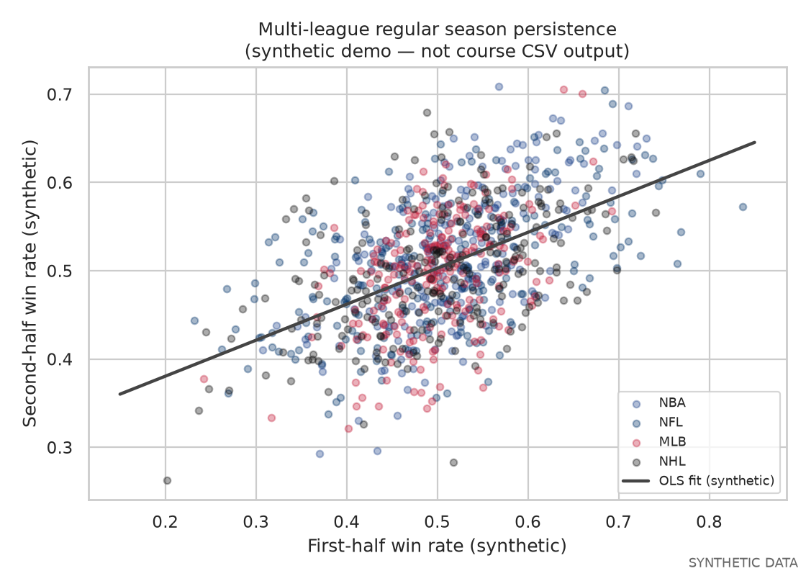
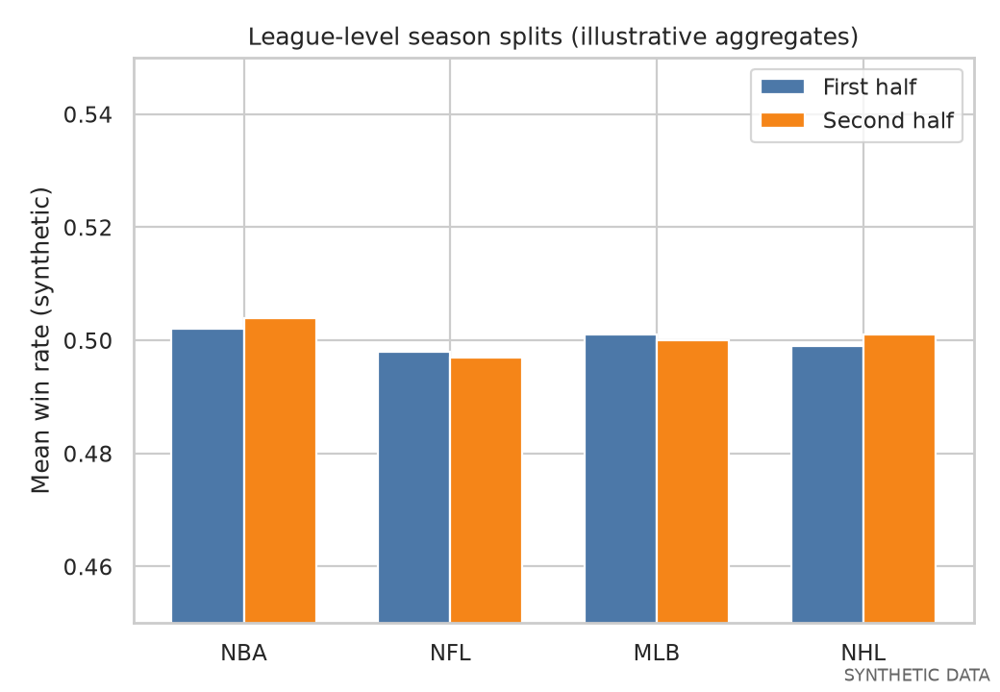
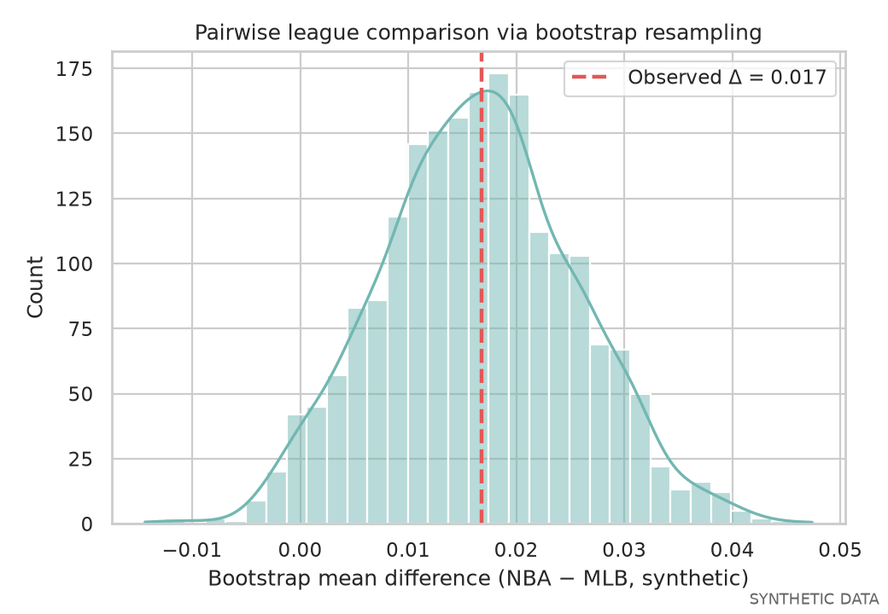

# Sports Performance Prediction (INFO 2950)

**Status:** Complete end-of-term data science project — **written report + Jupyter notebook** (raw league CSVs not shipped in this repo).

**Course:** INFO 2950 — Introduction to Data Science (Cornell)

End-of-term project applying **regression**, **EDA**, and **bootstrap inference** to **public professional sports statistics** across MLB, NFL, NBA, and NHL. The notebook builds team-season win rates from regular-season splits, fits OLS models for first- vs second-half persistence, and compares leagues with resampling tests.

---

## Stack

| Layer | Technology |
|-------|------------|
| Language | **Python** (Jupyter) |
| Libraries | pandas, NumPy, **statsmodels** (OLS), seaborn, matplotlib |
| Methods | Feature aggregation by team/season, linear regression, bootstrap significance tests |
| Deliverables | `final_analysis.ipynb`, `project-report.pdf` |

---

## Key findings (coursework)

- **Within-season persistence:** First-half win rate is positively associated with second-half win rate in pooled and league-specific OLS fits (see report and notebook).
- **League context matters:** Mean win rates and split-to-split stability differ by sport; pairwise league comparisons use bootstrap resampling rather than assuming identical variance.
- **Reproducible workflow:** The notebook documents data cleaning paths (`data/cleaned/*.csv` in the original project layout), aggregation logic, plots, and model summaries in one linear narrative.

---

## Preview figures (synthetic)

Raw course CSVs are not included in this public repo. The images below are **synthetic, clearly labeled demos** that mirror the analysis shapes (scatter + OLS, league splits, bootstrap difference). Regenerate anytime:

```bash
pip install matplotlib seaborn numpy
python scripts/generate_synthetic_figures.py
```

| Figure | Description |
|--------|-------------|
|  | First- vs second-half win rates with illustrative OLS trend |
|  | Mean first/second-half rates by league (demo aggregates) |
|  | Resampled NBA−MLB mean difference with observed Δ |

---

## Artifacts in this folder

| File | Description |
|------|-------------|
| [final_analysis.ipynb](./final_analysis.ipynb) | Reproducible analysis notebook (expects local `data/cleaned/` CSVs from coursework) |
| [project-report.pdf](./project-report.pdf) | Final written report with methods and figures |
| [scripts/generate_synthetic_figures.py](./scripts/generate_synthetic_figures.py) | Portfolio-safe synthetic figure generator |
| `figures/*.png` | Synthetic preview plots for GitHub README rendering |

---

## How to explore

1. Open **`project-report.pdf`** for the full narrative and results.
2. Open **`final_analysis.ipynb`** in Jupyter Lab or VS Code (Python env with pandas, statsmodels, seaborn).
3. Skim the **synthetic figures** above on GitHub, or regenerate them with the script if you clone the repo.

---

## Data note

**Academic use only.** The original project used **public sports statistics** (box scores and derived team-season features)—not proprietary employer data and **no student PII**. This repository omits raw CSVs; synthetic figures are for portfolio display only.

Parent index: [school-projects README](../README.md).
