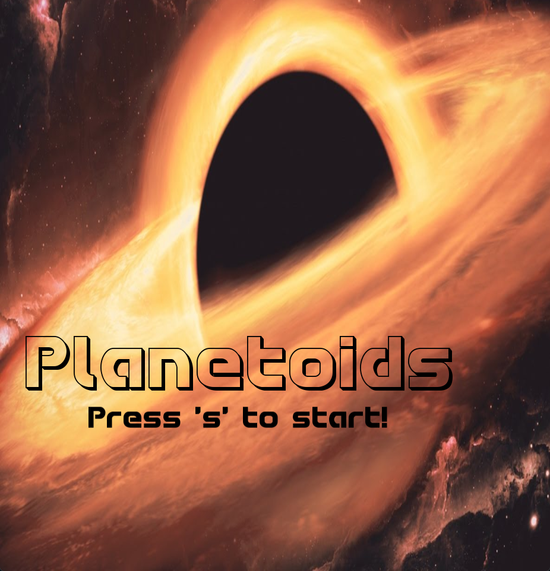
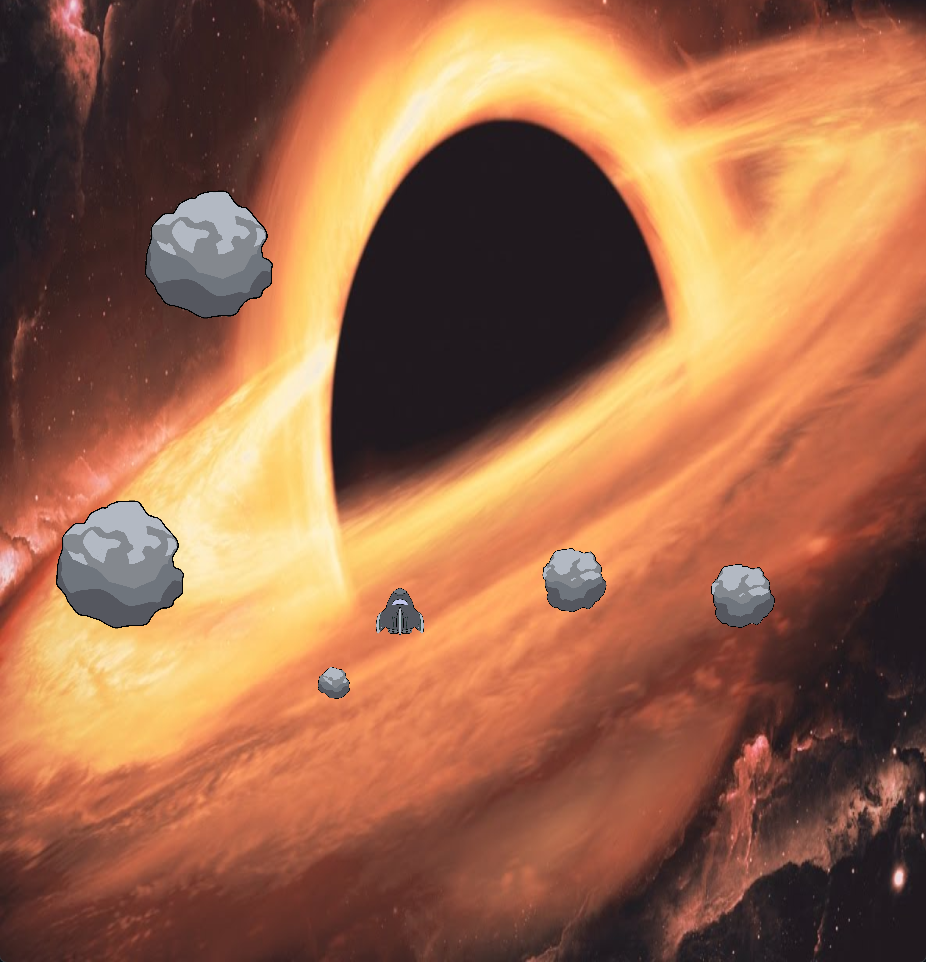

# Planetoids (CS 1110)

**Status:** Complete coursework game — **runnable locally** (Python 3 + Kivy).

**Course:** CS 1110 — Introduction to Computing (Cornell)

Asteroids-style arcade game built in Python with the course **game2d** library (Kivy-backed sprites and game loop). Demonstrates object-oriented design, real-time updates, vector motion, and collision handling.

---

## Demo on GitHub

CI runs a **non-interactive smoke test** on pushes and PRs that touch this folder (imports core modules; no gameplay input required).

[](https://github.com/Geoffreythemiller/GeoffreyMillerProjects/actions/workflows/planetoids-smoke.yml)

After you merge the workflow, open **Actions → Planetoids smoke** for the latest run. For a playable demo, run locally (below) or add an optional `demo.gif` under [Add demo assets](#add-demo-assets).

---

## Stack

| Layer | Technology |
|-------|------------|
| Language | Python 3 |
| Graphics / loop | **Kivy** via bundled `game2d/` |
| Numerics | NumPy (motion helpers in `game2d/`) |
| Assets | `Images/`, `Sounds/`, `Fonts/`, wave JSON in `Data/` |

---

## How to run

From the repository root:

```bash
cd school-projects/planetoids
python -m venv .venv
source .venv/bin/activate          # Windows: .venv\Scripts\activate
pip install -r requirements.txt
python __main__.py
```

Run commands from **`school-projects/planetoids/`** so relative paths to assets resolve correctly.

**Entry point:** `__main__.py` → `Planetoids(...).run()` in `app.py`. Keep `Images/`, `Sounds/`, `Fonts/`, and `Data/` next to the Python modules.

### Run locally (Windows)

1. Install [Python 3.11+](https://www.python.org/downloads/windows/) and check **Add python.exe to PATH** during setup.
2. Open **PowerShell** or **Command Prompt**:

```powershell
cd path\to\GeoffreyMillerProjects\school-projects\planetoids
python -m venv .venv
.venv\Scripts\activate
pip install -r requirements.txt
python __main__.py
```

3. Use arrow keys / course controls to play. If Kivy fails to open a window, install the latest [Visual C++ redistributable](https://learn.microsoft.com/en-us/cpp/windows/latest-supported-vc-redist) and retry.

---

## Add demo assets

This folder already includes **`enter-page.png`** and **`screenshot.png`** for README previews. Optionally add:

| File | Use |
|------|-----|
| `demo.gif` | Short loop showing movement and shooting |

Suggested embed after you add a GIF:

```markdown

```

---

## Skills demonstrated

* Object-oriented game entities (`models.py`) and controller logic (`app.py`)
* Event-driven game loop and frame updates
* Collision detection and wave-based level data (`Data/*.json`)
* Asset management (sprites, sound effects, fonts)

---

## Project layout

```text
planetoids/
├── __main__.py      # CLI entry
├── app.py           # Main game controller
├── models.py        # Ships, asteroids, projectiles
├── consts.py        # Screen and gameplay constants
├── wave1.py         # Wave configuration helpers
├── game2d/          # Course 2D/Kivy helpers (do not relocate)
├── Data/            # Level / wave JSON
├── Images/ Sounds/ Fonts/
├── enter-page.png   # start screen capture
├── screenshot.png   # gameplay capture
├── demo.gif         # optional — you add
└── requirements.txt
```

---

## Preview

Start screen:



Gameplay:



Ship sprite (representative in-repo art):


*CS 1110 coursework — arcade prototype, not a shipped product.*

---

## Data note

**Academic project only.** No network services, credentials, or employer systems. All assets are local course/game files.

Parent index: [school-projects README](../README.md).
